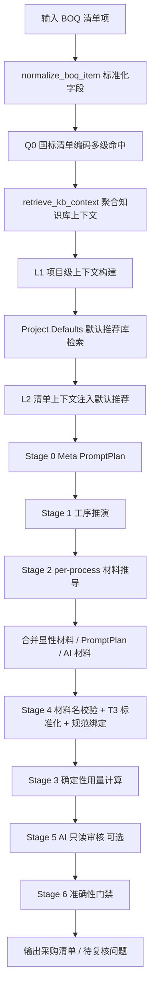
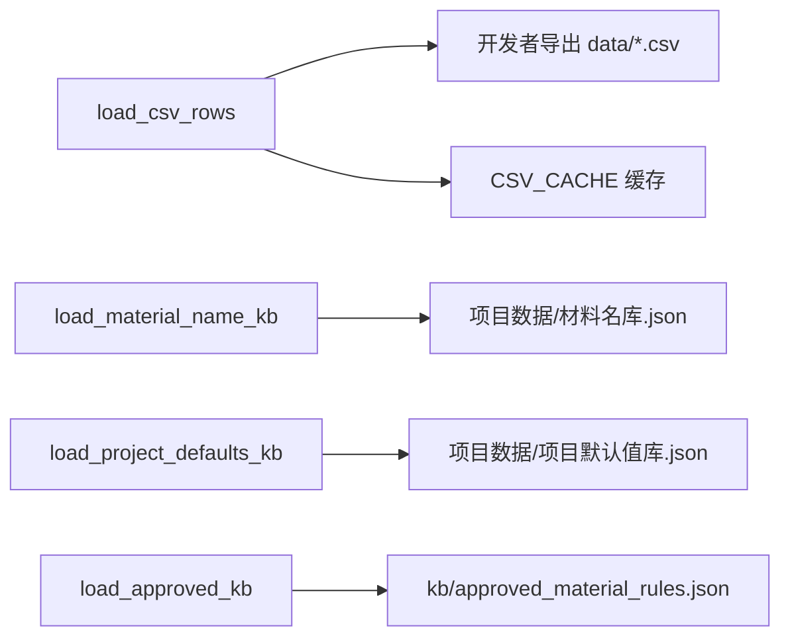
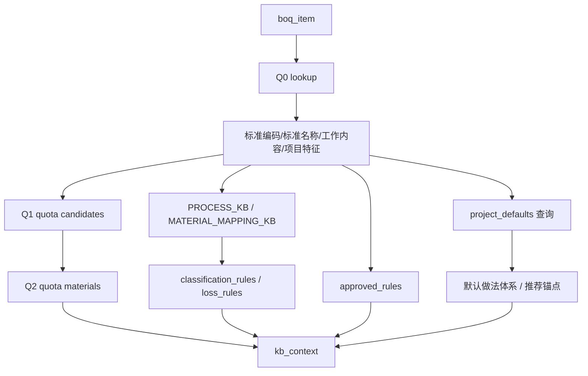
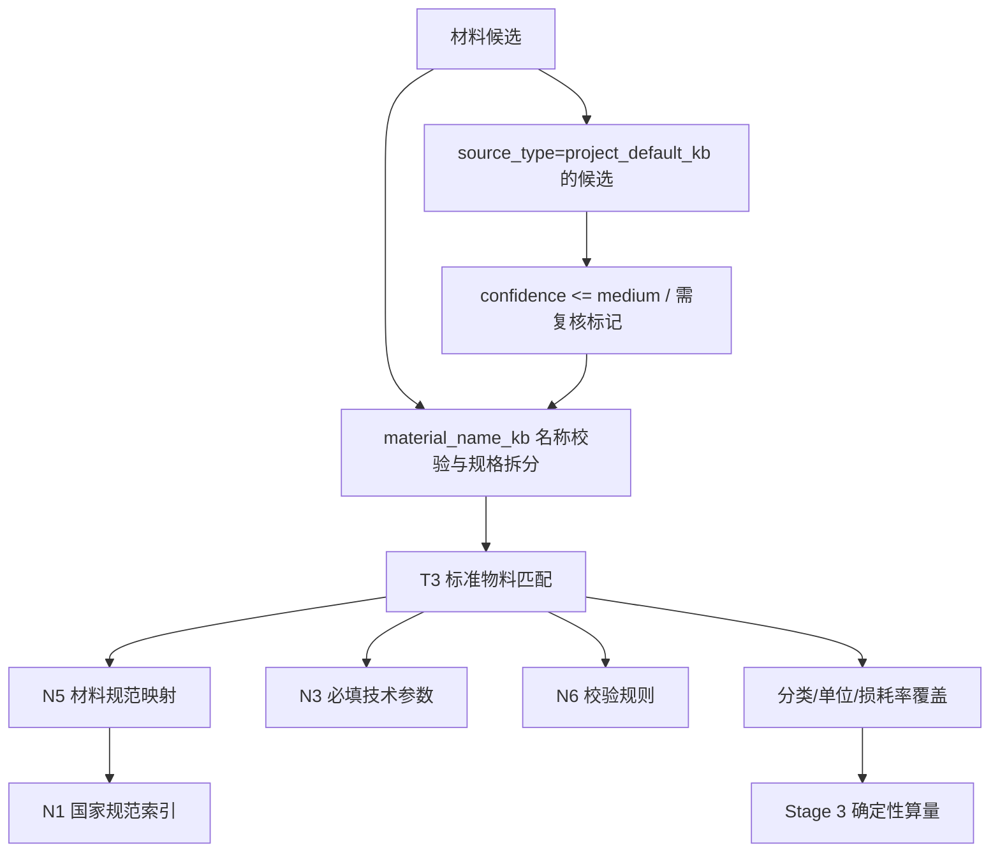

# BOQ 工程量清单转采购清单流水线方案

> 当前实现文件：`流水线测试.py`（命令行）+ `服务端/流水线执行.py`（Web端）
> 目标：把任意工程量清单项拆解为可采购、可校验、可追溯的材料清单。  
> 核心原则：准确度优先。宁可标记待复核，也不编造材料、规格、损耗率和规范依据。

---

## 1. 总体目标

本任务不是简单从清单文本里抽几个材料词，而是建立一条“标准清单识别 → 工序理解 → 材料推导 → 标准物料校验 → 确定性算量 → 审核门禁”的流水线。

最终输出的每一条采购材料都应回答清楚：

| 问题 | 输出要求 |
|---|---|
| 这是不是材料？ | 通过材料名校验，剔除人工、机械、动作词、占位词 |
| 材料名是否正规？ | 尽量命中 T3 标准物料库，名称与规格分离 |
| 为什么要采购？ | 来自项目特征、工序、Q1/Q2 定额、T2/T3 知识库或人工确认规则 |
| 适不适合这个清单？ | 与 Q0 标准清单、项目特征、适用范围、排除关键词做对比 |
| 数量怎么算？ | 只用确定性公式、消耗系数或已知规则；缺参数则 pending |
| 损耗率来自哪里？ | T2/内置规则、T3 品类标准损耗率或 pending，不让 AI 直接编 |
| 有无国家规范依据？ | 通过 T3 → N5 → N1/N3/N6 关联返回标准编号与校验参数 |

---

## 2. 当前流水线总览



当前阶段顺序里，Stage 4 在 Stage 3 之前执行。这是有意设计：先把材料名、规格、单位、分类、规范校验清楚，再做算量，避免用错误材料名去计算。

`Project Defaults` 是新接入的“项目默认做法与材料推荐知识库”。它只在缺少参数时给 AI 提供常规做法锚点，不直接合并为最终采购材料。若 AI 采纳其中材料，必须标记 `source_type=project_default_kb`，并在 Stage 4/Stage 6 继续校验。

---

## 3. 阶段运转逻辑

### 3.1 输入标准化

入口函数：`normalize_boq_item`

支持字段来源：

| 标准字段 | 可识别输入字段 |
|---|---|
| `code` | `code`、`清单编码`、`项目编码`、`编码` |
| `name` | `name`、`清单名称`、`项目名称`、`名称` |
| `feature_text` | `feature_text`、`feature`、`项目特征`、`特征` |
| `quantity` | `quantity`、`qty`、`工程量`、`数量` |
| `unit` | `unit`、`计量单位`、`单位` |

输入标准化后会立即调用 Q0 识别，补齐：

- `standard_code`
- `standard_name`
- `t1_section`
- `work_scope`
- `standard_features`
- `standard_work_items`
- `standard_unit`
- `calculation_rule`
- `q0_match`
- `code_name_conflict`
- `concrete_strength`

### 3.2 Q0 国标清单编码识别

入口函数：

- `code_fallback_candidates`
- `lookup_q0_standard`
- `infer_standard_boq_from_code`

Q0 使用两个国家标准清单表：

- `Q0_清单项目编码_房建工程.csv`
- `Q0_清单项目编码_安装工程.csv`

编码回退规则：

| 输入编码层级 | 示例 | 含义 | 匹配方式 |
|---|---:|---|---|
| 12 位 | `010507001001` | 清单顺序码 | 先尝试完整编码 |
| 9 位 | `010507001` | 国标项目编码 | 回退到标准项目编码 |
| 6 位 | `010507` | 分部编码 | 回退到分部 |
| 4 位 | `0105` | 章节/分部前缀 | 找该前缀下候选 |
| 2 位 | `01` | 专业工程代码 | 最低置信候选 |

重要规则：

1. 不再用硬编码 `standard_map` 兜底。
2. Q0 命中低置信时，只作为候选，不强行认定。
3. 如果编码命中但名称语义明显不一致，会生成 `code_name_conflict`，Stage 6 必须要求人工复核。
4. 回退到章节/分部前缀时，会按清单名称和项目特征给候选打分，选得分最高项，同时保留 `top_candidates` 和 `trace`。

### 3.3 Q0 标准特征对比

入口函数：

- `compare_standard_features`
- `build_feature_comparison`

对比内容：

| 对比对象 | 目的 |
|---|---|
| Q0 `项目特征` vs 实际 `feature_text` | 找出标准要求但输入未明示的特征 |
| 实际 `feature_text` vs Q0 `项目特征` | 找出实际额外增加的材料、做法、厚度、强度、部位 |
| Q0 `工作内容` vs 实际做法 | 判断工序范围是否可能扩大或缩小 |

输出用于 Stage 0 和 Stage 1，让 AI 不是裸推理，而是在标准范围内判断。

### 3.4 知识库上下文聚合

入口函数：`retrieve_kb_context`

它把当前清单对应的知识整合成一个 `kb_context`：

```json
{
  "boq_item": {},
  "process_rules": [],
  "material_rules": [],
  "classification_rules": [],
  "loss_rules": [],
  "approved_rules": [],
  "quota_candidates": [],
  "quota_materials": [],
  "forbidden_outputs": [],
  "constraints": []
}
```

命中逻辑：

| 知识类型 | 命中方式 |
|---|---|
| `process_rules` | `match_codes` 与输入编码或标准编码匹配 |
| `material_rules` | 编码匹配，或别名/材料名出现在清单文本中 |
| `classification_rules` | 别名/材料名出现在清单文本中，或由 material_rules 反向补齐 |
| `loss_rules` | 别名/材料名出现在清单文本中，或由 material_rules 反向补齐 |
| `approved_rules` | 人工确认规则按标准编码、名称、特征签名匹配 |
| `quota_candidates` | Q1 中 `boq_code = standard_code` 后按名称/特征排序 |
| `quota_materials` | Q2 中对应定额的材料消耗候选，过滤人工、机械和其他材料费 |

如果没有命中工序规则：

- 若 Q0 有工作内容，则构造 `Q0-标准编码` 工序约束；
- 若 Q0 也没有，则给 `GENERIC-PROCESS`，要求 AI 基于清单名称和特征推理，但必须标记风险。

### 3.5 L1-L4 分层上下文

入口函数：

- `build_L1_context`
- `build_L2_context`
- `build_L3_context`
- `build_L4_context`

分层目的：每个阶段只拿它需要的上下文，减少无关信息干扰。

| 层级 | 名称 | 注入阶段 | 内容 |
|---|---|---|---|
| L1 | 项目级上下文 | 全阶段可见 | 项目类型、地区、适用规范、项目默认损耗率 |
| L1 | 项目业态/结构上下文 | Project Defaults 检索 | `project_category`、`structure_type`、`height_scope`，可由环境变量注入 |
| L2 | 清单项上下文 | Stage 0、Stage 1、Stage 2 | 编码、名称、特征、工程量、Q0、特征对比、定额候选、材料规则摘要、默认推荐上下文 |
| L3 | 工序级上下文 | Stage 2 per-process | 当前工序、清单摘要、PromptPlan 关注点 |
| L4 | 材料级上下文 | Stage 3、Stage 4、Stage 5 | 当前材料分类、损耗、标准化、规范引用 |

当前项目级默认值支持以下环境变量：

| 环境变量 | 含义 | 示例 |
|---|---|---|
| `PROJECT_CATEGORY` | 项目业态 | `住宅`、`政府保障房`、`地下车库` |
| `STRUCTURE_TYPE` | 结构类型 | `剪力墙结构`、`框架剪力墙结构`、`钢结构` |
| `HEIGHT_SCOPE` | 建筑高度范围 | `多层`、`高层`、`超高层` |

若主体结构类清单缺少 `STRUCTURE_TYPE`，默认推荐库不会展开结构体系材料，只保留特征触发推荐，避免错套结构做法。

### 3.5.1 Project Defaults：项目默认推荐库检索

入口函数：

- `load_project_defaults_kb`
- `retrieve_project_defaults`
- `infer_project_default_phase`
- `infer_project_default_locations`

检索输入：

| 输入 | 来源 |
|---|---|
| `project_category` | L1 / `PROJECT_CATEGORY` |
| `structure_type` | L1 / `STRUCTURE_TYPE` |
| `height_scope` | L1 / `HEIGHT_SCOPE` |
| `phase` | 根据 Q0 分部、清单名称、项目特征自动推断 |
| `locations` | 根据项目特征中的地下室、屋面、外墙、楼地面等关键词推断 |

匹配顺序：

```text
feature_trigger
  > section_code_match    ← AI生成的默认材料体系，按 Q0 分部编码精确命中
  > exact_all_dimensions
  > partial_dominant_dimensions
  > phase_default
  > no_match
```

输出结构：

```json
{
  "query": {
    "project_category": "住宅",
    "structure_type": "剪力墙结构",
    "height_scope": "高层",
    "phase": "保温工程",
    "locations": ["外墙"]
  },
  "matched_defaults": [
    {
      "system_id": "SYS-INS-XPS-THIN-PLASTER",
      "system_name": "XPS薄抹灰外墙外保温体系",
      "match_level": "feature_trigger",
      "priority": 95,
      "policy": {
        "must_yield_to_feature_text": true,
        "must_pass_t3": true,
        "can_auto_add_materials": false,
        "requires_review_if_not_in_feature": true
      },
      "recommendations": []
    }
  ],
  "prompt_injection": "给 Stage0/1/2 的默认推荐提示",
  "risk_notes": []
}
```

安全边界：

- 默认推荐库只注入 prompt，不直接进入最终材料清单；
- 没挂材料的预留体系不注入材料候选，只保留体系提示；
- 命中排除规则时，相关体系和材料会被排除；
- AI 采纳默认推荐材料时，`confidence` 不得高于 `medium`；
- Stage 6 会把”仅由默认推荐库支撑、未被项目特征明示”的材料列为待复核。

### 3.5.2 AI 生成的默认材料体系候选（DeepSeek）

入口脚本：`工具脚本/deepseek_生成房建安装默认材料体系.py`

当项目默认值库初始覆盖不足（仅覆盖主体结构等少量 phase）时，使用 DeepSeek 按 Q0 国标清单附录和分部编码，批量生成默认材料体系候选。

**生成方式：**

| 维度 | 说明 |
|------|------|
| 输入 | Q0 `清单项目编码` (1665 条) → 按 appendix + section 分组 |
| 模型 | DeepSeek-chat / deepseek-v4-pro |
| 输出 | 每个分部最多 1 个 system，每个 system 含 3~10 条材料推荐 |
| 覆盖 | 29/29 个 Q0 附录、197/216 个 Q0 分部 |

**与原有系统的差异：**

| 维度 | 原有手工策展系统 | AI 生成候选系统 |
|------|-----------------|----------------|
| 组织方式 | 按施工 phase + 结构类型 | 按 Q0 附录 + section_code |
| 匹配方式 | phase + structure_type + height_scope + location | **section_code 精确匹配**（优先级仅次于特征触发） |
| 适用性 | 跨结构类型做法的精确推荐 | 仅知 Q0 编码时的广覆盖兜底 |
| source_type | `project_default_kb` | `project_default_kb_ai_candidate`（流水线中统一归一化为 `project_default_kb`） |
| 材料附带 | 算量公式、默认规格值、必填参数 | 规格描述、审核意见、国标引用 |

**Phase 映射：**

AI 系统以 Q0 `appendix_name` 标识，合并时通过 24 条映射自动推断 KB 的 `phase` 字段：

```
屋面及防水工程 → 防水工程
电气设备安装工程 → 电气安装工程
消防工程 → 消防工程
...
```

同时自动扩展 `phase_matrix` 使安装工程 phase（电气安装、给排水安装、暖通安装、智能化安装等）可被检索。

**入流水线后的行为：**

1. BOQ 项经 Q0 识别后获得 `section_code`（分部编码，如 `010901`）
2. `retrieve_project_defaults` 的 section_code 匹配层直接命中该分部对应的 AI 系统
3. AI 系统的材料推荐作为 prompt 上下文注入 Stage 0/1/2
4. 材料进入流水线后 source_type 统一归一化为 `project_default_kb`，与手工策展条目等同对待
5. Stage 6 复核逻辑完全适用

### 3.6 Stage 0：Meta PromptPlan

入口函数：`run_meta_strategy`

目标：不是拆材料，而是为后续阶段生成策略。

输出结构：`PromptPlan`

| 字段 | 作用 |
|---|---|
| `stage1_prompt` | 工序拆解专用提示词 |
| `stage2_prompt` | 材料推导专用提示词 |
| `stage5_prompt` | 审核专用提示词 |
| `quantity_strategy` | 材料算量策略提示 |
| `forbidden_materials` | 本清单不应输出的材料 |
| `risk_flags` | 风险标记，如 Q0 低置信、编码名称冲突 |
| `knowledge_conflicts` | 知识库命中但与实际特征冲突的项 |
| `must_include_materials` | 项目特征明示或规则要求必须考虑的材料 |

安全外壳由代码固定注入，不允许 AI 覆盖：

- 只输出 JSON；
- 不编造材料名、规格、单位、损耗率；
- 禁止输出人工、机械、运输服务；
- 知识库与项目特征冲突时，以项目特征为准，并说明原因。

Stage 0 调用失败时，走 `build_fallback_strategy`，仍然保留风险门禁。

Stage 0 的上下文现在包含 `project_defaults`。它的作用是帮助 Meta 层判断“缺参数时可参考哪些常规体系”，但不能把默认体系直接转成 `must_include_materials`。

### 3.7 Stage 1：工序推演

输入：

- L1
- L2
- PromptPlan
- `process_rules`
- Q0 标准特征和工作内容
- `project_defaults.prompt_injection`

输出结构：

```json
{
  "standard_match": {},
  "processes": [
    {
      "step": 1,
      "name": "工序名称",
      "is_main": true,
      "description": "说明",
      "typical_materials": "可能涉及材料",
      "evidence": "依据"
    }
  ]
}
```

兜底路径：

- 若 AI 返回非标准 JSON，调用 `build_processes_from_text_or_context`；
- 若 AI 调用失败，也调用 `build_processes_from_text_or_context`；
- 兜底优先使用 `process_rules` 和 Q0 `standard_work_items`。
- 默认推荐库只能帮助识别常规工序边界，不能覆盖项目特征或强行补材料。

### 3.8 Stage 2：材料推导

当前实现：per-process 并发推理。

入口函数：

- `derive_materials_for_process`
- `merge_per_process_materials`
- `build_materials_from_feature_hints`
- `materials_from_strategy`
- `merge_material_candidates`

执行方式：

1. 只对主工序发起材料推导；
2. 多个主工序时用 `asyncio.gather` 并发，上限 5；
3. 每个工序只注入 L3，不把全量 KB 塞进去；
4. AI 输出材料候选后，与项目特征明示材料、PromptPlan 必须材料合并；
5. 合并时会去重，并避免泛化词覆盖更具体材料。
6. `project_defaults.prompt_injection` 会进入 Stage 2，用作材料推导锚点。

材料来源优先级不是“谁覆盖谁”，而是全部进入候选，再由 Stage 4 校验：

| 来源 | 作用 |
|---|---|
| 项目特征明示材料 | 不能漏掉 |
| PromptPlan `must_include_materials` | 策略层强制纳入候选 |
| AI per-process 推理 | 补充工序隐含材料 |
| T3 动态词库抽取 | 从文本中识别标准物料线索 |
| Q1/Q2 定额材料消耗 | 作为候选依据，不直接强行采购 |
| T2/内置材料映射规则 | required/conditional 材料补入 |
| Project Defaults 默认推荐库 | 缺参数推荐锚点；不自动采购，采纳后必须 `source_type=project_default_kb` |

### 3.9 Stage 4：材料名校验、T3 标准化、规范绑定

入口函数：

- `validate_and_constrain_materials`
- `preprocess_material_candidate`
- `split_spec_from_name`
- `validate_material_name`
- `apply_t3_standardization`
- `get_material_standard_refs`
- `extract_required_standard_params`

这一阶段是准确性核心。

#### 3.9.1 材料名预处理

使用本地 `项目数据/材料名库.json`：

| 功能 | 说明 |
|---|---|
| 规格拆分 | `C30预拌混凝土` → `预拌混凝土` + `C30` |
| 动作词拦截 | `新增门`、`拆除墙体`、`浇筑混凝土` 等不作为材料 |
| 占位词拦截 | `其他`、`待定`、`详见` 等不作为材料 |
| 材料结尾词支撑 | 通过正规采购物料结尾词判断是否像材料名 |
| 长名称复核 | 超出正规物料名 P99 长度时标记 `needs_name_review` |

校验策略：

```text
非法动作词/占位词/费用项 = 直接 invalid，剔除
T3 命中 / KB 命中 / 有效材料结尾词命中 = 可进入标准化
均不命中 = 保留为 needs_review，但不能当作高可信标准材料
```

#### 3.9.2 T3 标准物料匹配

入口函数：

- `match_t3_material`
- `score_t3_material_match`
- `apply_t3_standardization`

匹配依据：

| T3 字段 | 用途 |
|---|---|
| `物料ID` | 标准物料主键 |
| `标准名称` | 输出标准名称来源 |
| `别名` | 处理常见叫法 |
| `特征关键词` | 识别规格、强度、材质等 |
| `适用范围(附录)` | 判断是否适合当前专业/附录 |
| `适用范围(项目)` | 判断是否适合当前清单项目 |
| `排除关键词` | 命中则降低或否决 |
| `采购单位` | 覆盖 AI 单位 |
| `分类(一级/二级/三级)` | 覆盖 AI 分类 |
| `标准代号` | 作为规范兜底 |
| `品类标准损耗率` | 可作为损耗依据 |

T3 命中后会覆盖：

- `material_name`
- `t3_standard_name`
- `material_id`
- `unit`
- `role`
- `category_l1`
- `category_l2`
- `category_l3`
- `waste_rate_estimate`
- `loss_basis`
- `standard_refs`
- `required_standard_params`

#### 3.9.3 国家规范绑定

规范链路：

```text
T3.物料ID
  -> N5_材料规范映射.material_id
  -> N1_国家规范索引.standard_id
  -> N3_材料技术参数定义
  -> N6_规范校验规则
```

当前输出会显示：

- 标准编号，如 `GB 1499.2-2024`、`GB/T 14902-2012`；
- 规范关系，如 product standard、验收规范；
- 必填参数，如钢筋牌号、混凝土强度等级；
- 若 T3 命中但没有规范映射，标记 `needs_standard_review`。

### 3.10 Stage 3：确定性用量计算

入口函数：`calculate_material_quantity`

计算原则：

1. 只做数学计算，不让 AI 编数量；
2. 清单量能直接作为材料量时，用 `coefficient`；
3. 面积、厚度、密度能确定时，用公式换算；
4. 缺少消耗系数或必要参数时，输出 `needs_review=True`；
5. 损耗率必须有来源，否则标记 pending。

输出字段：

| 字段 | 含义 |
|---|---|
| `material_name` | 材料名 |
| `design_qty` | 设计用量 |
| `unit` | 采购单位 |
| `loss_rate` | 损耗率 |
| `loss_rate_source` | 损耗率来源 |
| `procurement_qty` | 含损耗采购量 |
| `formula` | 计算公式 |
| `needs_review` | 是否需要人工复核 |
| `notes` | 缺参或风险说明 |

### 3.11 Stage 5：AI 只读审核

是否执行：由环境变量 `RUN_REVIEW=1` 控制。

定位：审核，不改写 Stage 3/4 结果。

审核内容：

- 是否有明显漏项；
- 工序和材料是否对应；
- pending 项是否需要提示；
- 风险等级和建议。

### 3.12 Stage 6：确定性准确性门禁

入口函数：`build_accuracy_review`

门禁项：

| 门禁项 | 触发后果 |
|---|---|
| Q0 未命中或低置信 | 需要人工复核 |
| 编码名称冲突 | 需要人工复核 |
| 项目特征明示材料遗漏 | 严重问题 |
| AI-only 材料无知识库支撑 | 严重问题 |
| T3 未标准化 | 不能自动通过 |
| T3 命中但无规范绑定 | 需要补规范 |
| 数量参数缺失 | 该材料采购量 pending |
| 损耗率依据缺失 | 该材料损耗 pending |
| 材料名/适用范围需复核 | 不能高可信通过 |

最终状态分两类：

- `全流程测试通过`：无严重准确性问题；
- `流程完成，但存在严重准确性问题，禁止自动通过`：有待复核或门禁项。

---

## 4. 知识库目录与结构

### 4.1 路径总览

| 类型 | 路径 | 说明 |
|---|---|---|
| 命令行流水线 | `流水线测试.py` | 完整 7-Stage 拆解流水线 |
| Web端流水线 | `服务端/流水线执行.py` | Web端拆解调度 |
| 知识库源数据 | `标准知识库/源数据/` | 全部CSV源文件（Q0/Q1/Q2/Q3/T3/N1-N6/品类/省份） |
| 本地材料名知识库 | `项目数据/材料名库.json` | 正规材料名形态、规格拆分规则 |
| 项目默认推荐库 | `项目数据/项目默认值库.json` | 399系统+1001材料推荐（AI生成+人工确认） |
| 人工确认规则 | `标准知识库/已确认材料规则.json` | 人工确认后写回 |
| 三级分类材料库 | `标准知识库/三级分类材料库.json` | CCE分类+28K别名索引 |
| O(1)查询索引 | `项目数据/本地知识库包/索引/` | 5个倒排索引，运行时O(1)查找 |
| 项目配置 | `项目数据/项目.json` | 项目级配置 |

### 4.2 Q0：国家标准清单项目编码库

文件：

- `Q0_清单项目编码_房建工程.csv`
- `Q0_清单项目编码_安装工程.csv`

核心字段：

| 字段 | 作用 |
|---|---|
| `专业工程代码` | 01 房建、03 安装等 |
| `专业工程名称` | 专业名称 |
| `附录编号` / `附录名称` | 国标附录 |
| `分部编码` / `分部名称` | 分部分项层级 |
| `项目编码` | 9 位国标项目编码 |
| `项目名称` | 标准清单名称 |
| `项目特征` | 标准应描述的特征 |
| `计量单位` | 标准单位 |
| `工程量计算规则` | 标准算量口径 |
| `工作内容` | 标准工作范围 |
| `trade_code` | 专业标记 |

调用位置：

- `standard_q0_rows`
- `lookup_q0_standard`
- `infer_standard_boq_from_code`

作用：

- 确定输入清单归属；
- 判断编码是否正确；
- 提供标准特征和工作内容；
- 为 Stage 0/1/6 提供标准边界。

### 4.3 Q1：定额索引库

文件：`Q1_定额索引.csv`

核心字段：

| 字段 | 作用 |
|---|---|
| `quota_id` | 定额子目主键 |
| `province` | 省份 |
| `quota_code` | 定额编号 |
| `project_name` | 定额项目名称 |
| `project_spec` | 定额规格 |
| `unit` | 定额单位 |
| `chapter_name` | 章节 |
| `work_content` | 工作内容 |
| `boq_code` | 对应 Q0 清单编码 |

调用位置：`quota_context_for_standard`

作用：

- 根据 `boq_code = standard_code` 找候选定额；
- 结合输入名称和特征排序；
- 给 AI 和审核提供“类似定额通常包含什么材料”的参考。

注意：Q1 是候选依据，不直接决定采购材料。实际项目特征优先。

### 4.4 Q2：定额材料消耗库

文件：`Q2_定额材料消耗.csv`

核心字段：

| 字段 | 作用 |
|---|---|
| `consumption_id` | 消耗明细主键 |
| `quota_id` | 关联 Q1 |
| `cost_type` | 人工、材料、机械等 |
| `material_code` | 定额材料编码 |
| `material_name_raw` | 定额原始材料名 |
| `material_spec_raw` | 定额规格 |
| `quantity` | 消耗量 |
| `unit` | 消耗单位 |
| `is_main_material` | 是否主材 |
| `material_id` | 已映射 T3 物料 ID |
| `map_status` | 映射状态 |
| `province` | 省份 |

调用位置：`quota_context_for_standard`

过滤规则：

- 排除 `cost_type` 为人工、机械；
- 排除 `其他材料费`；
- 只作为候选材料消耗，不直接强行输出。

### 4.5 Q3：定额材料映射库

文件：`Q3_定额材料映射.csv`

核心字段：

| 字段 | 作用 |
|---|---|
| `mapping_id` | 映射主键 |
| `material_name_raw` | 原始材料名 |
| `material_name_clean` | 清洗名 |
| `material_id` | 对应 T3 物料 ID |
| `match_confidence` | 映射置信度 |
| `matched_name` | 匹配名称 |
| `category` | 类别 |
| `verified` | 是否确认 |

当前脚本主要通过 Q2 中已有 `material_id` 使用映射结果，后续可以把 Q3 直接纳入 Stage 4 的二次匹配。

### 4.6 T3：标准物料库

文件：

- `T3_房建_标准物料库.csv`
- `T3_安装_标准物料库.csv`

核心字段：

| 字段 | 作用 |
|---|---|
| `物料ID` | 标准物料主键 |
| `标准名称` | 正规采购材料名称 |
| `分类(一级/二级/三级)` | 采购分类 |
| `分类路径` | 分类完整路径 |
| `别名` | 常见名称 |
| `特征关键词` | 规格、等级、材质关键词 |
| `适用范围(附录)` | 国标附录适用范围 |
| `适用范围(项目)` | 清单项目适用范围 |
| `排除关键词` | 不适用场景 |
| `采购单位` | 标准采购单位 |
| `规格模式JSON` | 规格格式 |
| `质量等级` | 质量等级 |
| `标准代号` | 产品或验收标准 |
| `品类树节点ID` | 品类节点 |
| `品类展示路径` | 品类展示 |
| `品类标准损耗率` | 标准损耗率 |

调用位置：

- `t3_catalog_rows`
- `build_material_lexicon_from_t3`
- `extract_materials_by_lexicon`
- `match_t3_material`
- `apply_t3_standardization`

作用：

- 动态生成材料词库；
- 标准化 AI/特征/定额输出的材料名；
- 覆盖采购单位、分类、标准名称、损耗率；
- 绑定国家规范。

### 4.7 T3 品类映射

文件：`T3_品类映射.csv`

核心字段：

| 字段 | 作用 |
|---|---|
| `material_id` | T3 物料 ID |
| `material_name` | 材料名 |
| `leaf_id` | 品类叶子节点 |
| `display_path` | 品类展示路径 |
| `match_method` | 映射方式 |
| `match_score` | 匹配分 |
| `standard_loss_rate` | 标准损耗率 |
| `loss_rate_pct` | 损耗率百分比 |
| `rule_code` | 规则编号 |

当前主要使用 T3 标准物料库自带品类和损耗字段；该表可作为后续损耗率和品类树的增强来源。

### 4.8 N1/N5/N3/N6：国家规范库

#### N1 国家规范索引

文件：`N1_国家规范索引.csv`

| 字段 | 作用 |
|---|---|
| `standard_id` | 标准编号 |
| `standard_name` | 标准名称 |
| `standard_type` | 产品标准、验收规范等 |
| `version_year` | 年份 |
| `effective_date` | 生效日期 |
| `status` | 是否现行 |
| `priority` | 优先级 |

#### N5 材料规范映射

文件：`N5_材料规范映射.csv`

| 字段 | 作用 |
|---|---|
| `material_id` | T3 物料 ID |
| `standard_id` | N1 标准编号 |
| `relation_type` | 产品标准/验收标准等 |
| `relevance` | primary/secondary |
| `use_scene` | 使用场景 |
| `covered_params` | 覆盖参数 |
| `clause_refs` | 条文或表号 |
| `active_flag` | 是否有效 |

#### N3 材料技术参数定义

文件：`N3_材料技术参数定义.csv`

| 字段 | 作用 |
|---|---|
| `material_id` | T3 物料 ID |
| `param_code` | 参数编码 |
| `param_name` | 参数名称 |
| `param_type` | 参数类型 |
| `required_level` | required/recommended |
| `procurement_visible` | 是否采购可见 |
| `boq_extractable` | 是否能从清单抽取 |
| `default_value` | 默认值 |
| `standard_id` | 来源标准 |
| `clause_id` | 条款 |

#### N6 规范校验规则

文件：`N6_规范校验规则.csv`

| 字段 | 作用 |
|---|---|
| `rule_id` | 校验规则 ID |
| `material_id` | T3 物料 ID |
| `rule_type` | 枚举、范围、条件校验 |
| `input_params` | 输入参数 |
| `condition` | 生效条件 |
| `check_target` | 校验对象 |
| `allowed_values` | 允许值 |
| `error_level` | block/warn |
| `error_message` | 错误说明 |
| `standard_id` | 来源标准 |
| `constraint_level` | 约束级别 |

调用位置：

- `n1_standard_rows`
- `n5_material_standard_rows`
- `n3_param_rows`
- `n6_rule_rows`
- `get_material_standard_refs`
- `extract_required_standard_params`

### 4.9 material_name_kb：材料名形态知识库

文件：`项目数据/材料名库.json`

来源：正规采购物料数据分析。

核心结构：

| key | 内容 |
|---|---|
| `source` | 数据来源说明 |
| `total_rows` | 原始行数 |
| `unique_names` | 唯一材料名数量 |
| `name_length` | 材料名长度分布，P99 为 39 |
| `sample_names` | 样例材料名 |
| `material_endings` | 正规材料名结尾词库 |
| `spec_extraction_rules` | 规格提取正则 |
| `illegal_name_patterns` | 非法材料名模式 |
| `spec_pattern_distribution` | 规格模式分布 |
| `key_rule` | 名称和规格分离原则 |

调用位置：

- `load_material_name_kb`
- `material_name_endings`
- `material_spec_rules`
- `split_spec_from_name`
- `validate_material_name`

应用效果：

| 输入 | 输出 |
|---|---|
| `新增门` | 非法材料名，剔除 |
| `C30预拌混凝土` | `预拌混凝土` + `C30` |
| `HRB400E热轧带肋钢筋` | `热轧带肋钢筋` + `HRB400E` |
| `DN100镀锌钢管` | `镀锌钢管` + `DN100` |
| `3:7灰土` | `灰土` + `3:7` |

### 4.10 project_defaults_kb：项目默认做法与材料推荐知识库

文件：`项目数据/项目默认值库.json`

定位：

> 当工程量清单缺少材料规格、做法层次、部位参数时，为 AI 提供“常规工程做法 + 常见材料规格 + 适用条件 + 禁用边界”的推荐锚点。它不是最终采购材料库。

当前统计：

| 子库 | 数量 | 说明 |
|---|---:|---|
| `meta` | 1 | 版本、定位、设计原则 |
| `dictionaries` | 8 组枚举 | 项目业态、结构类型、高度范围、分部、部位、角色、来源、置信度 |
| `phase_matrix` | 13 条 | 分部是否进入默认推荐库，以及敏感维度定义 |
| `default_systems` | 42 个 | 常规做法体系 |
| `material_recommendations` | 63 条 | 推荐材料明细，挂在体系下 |
| `trigger_rules` | 21 条 | 按关键词触发体系推荐 |
| `exclusion_rules` | 10 条 | 冲突排除规则 |
| `standard_refs` | 15 条 | 推荐材料到规范的索引 |
| `retrieval_policy` | 1 | 查询顺序、优先级、Stage 使用规则 |

顶层结构：

```json
{
  "meta": {},
  "dictionaries": {},
  "phase_matrix": {},
  "default_systems": [],
  "material_recommendations": [],
  "trigger_rules": [],
  "exclusion_rules": [],
  "standard_refs": [],
  "retrieval_policy": {}
}
```

#### 4.10.1 dictionaries

主要枚举：

| 字典 | 内容 |
|---|---|
| `project_category` | 住宅、政府保障房、公寓、别墅、地下车库、相关配套、更新改造 |
| `structure_type` | 钢-混凝土组合结构、钢结构、剪力墙结构、框架剪力墙结构、框架结构、砌体结构、砖混结构 |
| `height_scope` | 多层、高层、超高层 |
| `phase` | 土石方、降水、桩基、支护、主体、防水、保温、门窗、外立面、粗装、栏杆、精装、其他 |
| `location` | 基础、地下室、地下车库、屋面、外墙、内墙、楼地面、天棚、厨卫、阳台等 |
| `material_role` | 主材、辅材、周转材料、措施材料 |
| `source_type` | `project_default_kb` |
| `confidence` | 默认推荐只允许 `medium` 或 `low` |

#### 4.10.2 phase_matrix

作用：决定哪个分部能使用默认推荐库，以及按哪些维度查询。

示例策略：

| 分部 | 是否进入 | 主维度 | 说明 |
|---|---|---|---|
| 主体结构工程 | 是 | 结构类型、高度范围 | 主体材料强依赖结构和高度 |
| 防水工程 | 是 | 部位 | 地下、屋面、厨卫等部位比结构更关键 |
| 保温工程 | 是 | 部位、高度、防火等级 | 外墙、屋面、地下室顶板做法不同 |
| 门窗工程 | 是 | 业态、高度、部位 | 外窗性能和项目类型有关 |
| 土石方/降水/桩基/支护 | 否 | 无 | 受地勘、专项方案影响，不适合默认推荐 |

#### 4.10.3 default_systems

`default_systems` 定义“常规做法体系”，不是材料清单。

典型字段：

| 字段 | 说明 |
|---|---|
| `system_id` | 做法体系 ID |
| `phase` | 所属分部 |
| `system_name` | 体系名称 |
| `applicable_project_category` | 适用项目业态 |
| `applicable_structure_type` | 适用结构类型 |
| `applicable_height_scope` | 适用高度范围 |
| `applicable_location` | 适用部位 |
| `typical_scene` | 常见场景 |
| `must_yield_to_feature_text` | 必须让位于项目特征 |
| `must_pass_t3` | 必须通过 T3 标准化 |
| `can_auto_add_materials` | 固定为 false |
| `requires_review_if_not_in_feature` | 未被项目特征支撑时需复核 |

#### 4.10.4 material_recommendations

`material_recommendations` 挂在 `system_id` 下，用于告诉 AI 常见材料组合。

关键字段：

| 字段 | 说明 |
|---|---|
| `rec_id` | 推荐材料记录 ID |
| `system_id` | 关联的做法体系 |
| `material_name` | 推荐材料名，后续必须过 T3 |
| `role` | 主材/辅材/周转材料 |
| `typical_spec` | 常见规格文本 |
| `spec_params` | 结构化规格参数 |
| `unit_hint` | 采购单位提示 |
| `auxiliary_group` | 配套辅材 |
| `basis` | 规范依据 |
| `loss_rate_hint` | 损耗提示，只能作为参考 |
| `t3_match_required` | 必须为 true |
| `source_type` | `project_default_kb` |
| `confidence` | 不得高于 medium |
| `can_auto_add` | 必须为 false |
| `requires_review_if_not_in_feature` | 必须为 true |

#### 4.10.5 trigger_rules

作用：根据项目特征关键词触发默认体系。

例子：

| 特征关键词 | 触发体系 |
|---|---|
| 挤塑板 / XPS / B1级挤塑 | XPS 薄抹灰外墙外保温体系 |
| 岩棉板 / A级保温 | 岩棉外墙保温体系 |
| SBS / 屋面卷材 | SBS 屋面防水体系 |
| 地下 / 防水 / 底板 | 地下室卷材防水体系 |

#### 4.10.6 exclusion_rules

作用：防止默认推荐库越推越多。

例子：

| 命中特征 | 排除 |
|---|---|
| 岩棉 | 排除 XPS/EPS 保温体系 |
| 挤塑板 / XPS | 排除岩棉体系 |
| 涂膜防水 / JS防水 / 聚氨酯防水 | 排除 SBS 卷材体系 |
| 拆除 / 铲除 / 凿除 | 拆除类词不得作为材料输出 |

#### 4.10.7 standard_refs

作用：为默认推荐材料提供规范索引，但最终规范仍以后续 T3/N 系列校验为准。

示例：

| 材料 | 规范 |
|---|---|
| 预拌混凝土 | `GB/T 14902-2012`、`GB 50204-2015` |
| 热轧带肋钢筋 | `GB 1499.2-2024`、`GB 50204-2015` |
| 挤塑聚苯板 | `GB/T 10801.2-2025` |
| 岩棉板 | `GB/T 25975-2018` |

#### 4.10.8 retrieval_policy

查询策略：

```text
feature_trigger
  > exact_all_dimensions
  > partial_dominant_dimensions
  > phase_default
  > no_match
```

Stage 使用边界：

| 阶段 | 用法 |
|---|---|
| Stage 0 | 帮助 Meta 识别缺参数时的常规体系 |
| Stage 1 | 辅助判断工序边界 |
| Stage 2 | 作为材料候选锚点 |
| Stage 4 | 采纳后必须过 T3 标准化 |
| Stage 6 | 未被项目特征支撑时强制复核 |

调用位置：

- `load_project_defaults_kb`
- `retrieve_project_defaults`
- `infer_project_default_phase`
- `infer_project_default_locations`

### 4.11 人工确认知识库

默认文件：`kb/approved_material_rules.json`

调用位置：

- `load_approved_kb`
- `find_approved_rules`
- `collect_learning_feedback`
- `save_approved_kb`

预期结构：

```json
[
  {
    "id": "APPROVED-...",
    "standard_code": "010502001",
    "name": "矩形柱",
    "feature_signature": "hash",
    "feature_text": "C30",
    "approved_materials": [
      {
        "material_name": "预拌混凝土",
        "spec_hint": "C30",
        "unit": "m³"
      }
    ],
    "rejected_materials": [],
    "user_note": ""
  }
]
```

作用：

- 把人工复核后的正确结论变成可复用知识；
- 下次同类清单可优先命中；
- 不应把一次错误 AI 输出写入，必须人工确认后再进入该库。

### 4.12 内置 T2 类规则

当前脚本内仍有四类内置规则：

| 变量 | 作用 |
|---|---|
| `PROCESS_KB` | 工序规则 |
| `MATERIAL_MAPPING_KB` | 清单/构件到材料的映射 |
| `MATERIAL_CLASSIFICATION_KB` | 材料角色、分类、采购单位 |
| `LOSS_RATE_KB` | 损耗率和依据 |
| `FORBIDDEN_OUTPUTS` | 禁止输出人工、机械、服务等 |

这些规则目前在代码中，后续建议迁移为 JSON/CSV，形成真正外部知识库。

---

## 5. 知识库调用关系

### 5.1 加载层



特点：

- CSV 读取后进入 `CSV_CACHE`，同一文件不会反复读磁盘；
- `material_name_kb.json` 读取后进入 `MATERIAL_NAME_KB_CACHE`；
- `project_defaults_kb.json` 读取后进入 `PROJECT_DEFAULTS_KB_CACHE`；
- 外部文件缺失时返回空列表/空对象，不让脚本直接崩溃，但会在门禁中体现风险。

### 5.2 清单级调用



### 5.3 材料级调用



---

## 6. 输出数据结构

单条清单最终返回：

```json
{
  "boq_item": {},
  "strategy": {},
  "processes": {},
  "materials": {},
  "calculations": [],
  "review": {},
  "accuracy_review": {}
}
```

### 6.1 材料行关键字段

```json
{
  "input_material_name": "C30预拌混凝土",
  "material_name": "预拌混凝土",
  "spec_hint": "C30",
  "t3_standard_name": "预拌混凝土 C30",
  "material_id": "MAT-CON-...",
  "unit": "m³",
  "role": "主材",
  "category_l1": "混凝土及砂浆",
  "category_l2": "预拌混凝土",
  "waste_rate_estimate": 0.01,
  "loss_basis": "T3品类标准损耗率...",
  "standardization_status": "matched",
  "standard_refs": [],
  "required_standard_params": [],
  "confidence": "high",
  "source": "T3标准物料库"
}
```

### 6.2 算量行关键字段

```json
{
  "material_name": "预拌混凝土",
  "design_qty": 49.086,
  "unit": "m³",
  "loss_rate": 0.01,
  "loss_rate_source": "T3标准物料库",
  "procurement_qty": 49.577,
  "formula": "清单量(48.6) x 系数(1.01)",
  "needs_review": false,
  "notes": ""
}
```

---

## 7. 准确性策略

### 7.1 不允许自动通过的情况

以下任一情况出现，都应禁止自动通过：

1. Q0 未命中或低置信；
2. 编码和名称明显冲突；
3. 项目特征明示材料被遗漏；
4. AI 输出的材料没有 T3、KB、显性特征任一支撑；
5. 材料未命中 T3 标准物料；
6. 已命中 T3 但缺国家规范绑定；
7. 材料适用范围和当前清单特征不匹配；
8. 用量缺必要参数；
9. 损耗率没有依据；
10. 材料名是动作词、费用项、占位词。
11. 材料仅由 `project_defaults_kb` 推荐、但未被项目特征明示或人工确认。

### 7.2 AI 的边界

AI 可以做：

- 读懂清单项目特征；
- 判断工序链；
- 根据工序推理候选材料；
- 发现可能漏项；
- 给审核建议。

AI 不可以做：

- 直接决定最终标准材料名；
- 编造采购单位；
- 编造损耗率；
- 编造国家规范；
- 在缺参数时强行算采购量；
- 把人工、机械、服务费输出为采购材料。
- 把 `project_defaults_kb` 的默认推荐直接当成最终采购结论。

### 7.3 知识库优先级

当前建议优先级：

```text
实际项目特征明示
  > Q0 标准清单范围
  > 人工确认知识库
  > T3 标准物料库
  > N1/N3/N5/N6 国家规范库
  > Q1/Q2 定额候选
  > 内置 T2 规则
  > project_defaults_kb 默认推荐
  > AI 推理候选
```

说明：

- 实际项目特征与定额冲突时，以实际项目特征为准；
- Q1/Q2 是“常见消耗候选”，不能覆盖实际特征；
- T3/N 系列是最终标准化和规范校验依据；
- `project_defaults_kb` 只在缺参数时提供常规做法锚点，不自动采购；
- AI-only 候选必须低可信，且必须经过 Stage 4 和 Stage 6。

---

## 8. 当前已实现能力

| 能力 | 状态 |
|---|---|
| Q0 多级编码回退 | 已实现 |
| Q0 编码名称冲突检测 | 已实现 |
| Q0 标准特征对比 | 已实现 |
| Q1/Q2 定额候选上下文 | 已实现 |
| T3 动态材料词库 | 已实现 |
| project_defaults_kb 默认推荐库加载 | 已实现 |
| 默认推荐库按业态/结构/高度/分部/部位查询 | 已实现 |
| 默认推荐库 trigger/exclusion 规则 | 已实现 |
| 默认推荐库 prompt 注入 | 已实现，进入 Stage0/1/2 |
| 默认推荐库不自动采购保护 | 已实现 |
| Stage 0 PromptPlan | 已实现，失败时有确定性兜底 |
| L1-L4 分层上下文 | 已实现 |
| Stage 2 per-process 并发材料推导 | 已实现 |
| 材料名/规格拆分 | 已实现 |
| 非材料名拦截 | 已实现 |
| T3 标准物料匹配 | 已实现 |
| N5/N1 规范引用 | 已实现 |
| N3/N6 参数与规则读取 | 已接入 |
| Stage 3 确定性算量 | 已实现 |
| Stage 5 AI 只读审核 | 已实现，可开关 |
| Stage 6 准确性门禁 | 已实现 |
| 默认推荐库候选复核门禁 | 已实现 |
| 人工确认规则读取 | 已实现 |
| 人工确认规则写回 | 已实现基础函数 |

---

## 9. 后续优化建议

### 9.1 把内置 T2 规则外迁

当前 `PROCESS_KB`、`MATERIAL_MAPPING_KB`、`MATERIAL_CLASSIFICATION_KB`、`LOSS_RATE_KB` 仍写在 Python 代码里。建议拆成：

```text
kb/
  process_rules.json
  material_mapping_rules.json
  material_classification_rules.json
  loss_rate_rules.json
  forbidden_outputs.json
```

代码只负责加载和检索，知识通过文件维护。

### 9.2 增强 Q3 使用

当前 Q3 没有成为主匹配入口。建议：

1. Q2 原始材料名若没有 `material_id`；
2. 先用 Q3 查历史映射；
3. 再进入 T3 模糊匹配；
4. Q3 verified=true 的规则优先级高于普通模糊匹配。

### 9.3 完善 N6 规则执行器

当前 N6 已读取，但还可以强化：

- enum 校验：如钢筋牌号只能在允许值中；
- range 校验：如厚度、强度等级范围；
- condition 校验：如 B1 级适用场景；
- block/warn 分级进入 Stage 6。

### 9.4 为每条材料保存证据链

建议每条材料输出：

```json
{
  "evidence_chain": [
    {"source": "项目特征", "text": "60mm厚C20细石混凝土"},
    {"source": "T3", "material_id": "MAT-CON-..."},
    {"source": "N5", "standard_id": "GB/T 14902-2012"},
    {"source": "Q2", "quota_id": "Q-SX-..."}
  ]
}
```

这样后续人工审核会更快。

### 9.5 输出分级

建议最终采购清单按可信度分级：

| 等级 | 条件 | 操作 |
|---|---|---|
| A 自动通过 | T3 命中、规范绑定、数量可算、无门禁问题 | 进入采购清单 |
| B 待复核 | T3 命中但数量或适用范围缺参数 | 人工补参数 |
| C 禁止通过 | 非材料名、未标准化、AI-only 无支撑 | 不进入采购 |

---

## 10. 推荐运行方式

### 10.1 交互式输入

```bash
/Users/qianqianawodebaobei/Desktop/智能清单/本地执行平台/.venv/bin/python \
/Users/qianqianawodebaobei/Desktop/智能清单/本地执行平台/流水线测试.py
```

输入清单后以 `END` 结束。

### 10.2 样例运行

```bash
.venv/bin/python 流水线测试.py --sample
```

### 10.3 开启 AI 审核

```bash
RUN_REVIEW=1 .venv/bin/python 流水线测试.py --sample
```

### 10.4 注入项目业态、结构和高度范围

`project_defaults_kb` 会读取以下环境变量作为 L1 项目上下文：

```bash
PROJECT_CATEGORY=住宅 \
STRUCTURE_TYPE=剪力墙结构 \
HEIGHT_SCOPE=高层 \
.venv/bin/python 流水线测试.py --sample
```

若不提供 `STRUCTURE_TYPE`，主体结构类清单不会展开结构体系默认材料；保温、防水等可通过项目特征关键词触发默认体系。

---

## 11. 一句话总结

这套方案的核心不是让 AI “自由发挥拆材料”，而是让 AI 在 Q0 国标清单、Q1/Q2 定额候选、T3 标准物料、N 系列国家规范、项目默认推荐库、人工确认知识库共同约束下做理解和补充。其中 `project_defaults_kb` 只负责缺参数时给常规做法锚点，不负责自动采购。最终能不能进入采购清单，由 Stage 4 的标准化和 Stage 6 的确定性门禁决定。

---

## 12. 当前已落地的执行与检查

### 12.1 默认推荐库执行字段

`项目数据/项目默认值库.json` 当前已进入 v2.2 可执行形态：

| 项目 | 当前结果 |
|---|---:|
| 做法体系 | 86 |
| 推荐材料 | 340 |
| quantity_rule 覆盖 | 340/340 |
| loss_rate_hint 覆盖 | 340/340 |
| default_spec_values 覆盖 | 340/340 |
| basis 规范依据覆盖 | 340/340 |
| standard_ref_ids 绑定 | 210/340 |
| 结构检查错误 | 0 |
| 结构检查警告 | 0 |

每条推荐材料不再只是“给 AI 看的文字”，而是可以被 Stage 3 直接读取：

```json
{
  "rec_id": "REC-0021",
  "material_name": "挤塑聚苯板(XPS)",
  "loss_rate_hint": 0.02,
  "quantity_rule": {
    "formula": "BOQ_AREA * THICKNESS_MM / 1000 * (1 + LOSS)",
    "depends_on": ["thickness_mm", "loss_rate"],
    "default_thickness_mm": 70
  },
  "default_spec_values": {
    "thickness_mm": 70,
    "fire_rating": "B1级"
  }
}
```

### 12.2 Stage 3 计算优先级

当前执行顺序：

```text
清单明示参数
  ↓
项目特征抽取参数
  ↓
project_defaults_kb.default_spec_values / quantity_rule.default_xxx
  ↓
pending + needs_review
```

只要使用默认参数，系统会计算推荐量，但不会自动通过：

```json
{
  "calculation_source": "project_defaults_kb.quantity_rule",
  "used_default_params": ["usage_per_m2"],
  "needs_review": true
}
```

### 12.3 新增检查脚本

结构检查：

```bash
.venv/bin/python 工具脚本/check_project_defaults_kb.py
```

当前期望输出：

```text
PASS project_defaults_kb
systems: 86
materials: 340
formula_families: 31
broken_refs/errors: 0
warnings: 0
```

黄金样例检查：

```bash
.venv/bin/python 工具脚本/check_pipeline_golden_cases.py
```

当前期望输出：

```text
PASS golden: thermal_wall_xps_50mm
```

该黄金样例断言：

- 保温墙面 XPS 50mm 能命中默认体系；
- XPS 计算为 `87.36 × 50 / 1000 × 1.02 = 4.455m³`；
- 专用粘接剂能按默认单耗算出 `449.904kg`；
- 耐碱玻纤网格布能按两层和搭接系数算出 `201.802m²`；
- 不允许出现壁纸、织锦缎、轻钢龙骨等串项材料；
- 使用默认参数时只进入“待复核”，不进入“全流程通过”。

### 12.4 数据规范化脚本

如果后续批量扩充 `project_defaults_kb.json`，先运行：

```bash
.venv/bin/python 工具脚本/enrich_project_defaults_kb.py
.venv/bin/python 工具脚本/normalize_project_defaults_kb.py
```

`enrich_project_defaults_kb.py` 会补齐：

- `default_spec_values.spec_text`；
- 可识别的 `thickness_mm / fire_rating / grade / diameter / dimensions / density_kg_m3`；
- `basis` 规范依据；
- 可匹配的 `standard_ref_ids`；
- `required_params` 空值规范化为 `[]`。

`normalize_project_defaults_kb.py` 会把常见的非执行型公式修正为执行型公式，例如：

- `THICKNESS(m) / 1000` 统一为 `THICKNESS_MM / 1000`；
- 保温专用粘接剂按 `BOQ_AREA * USAGE_PER_M2`；
- 瓷砖胶粘剂按 `BOQ_AREA * USAGE_PER_M2`；
- 地砖/墙砖/面砖按 `BOQ_AREA * COEFF`；
- 密封胶类按 `BOQ_LENGTH * USAGE_PER_M`；
- 注浆类补默认截面参数。

---

## 13. 知识库数据架构

所有知识库数据已内置在项目内，**无外部依赖**。数据按"源CSV → 直接读取 + O(1)索引辅助"模式工作，不再保留中间JSON镜像层。

### 13.1 数据源：标准知识库/源数据/

所有知识库数据已内置在项目 `标准知识库/源数据/` 目录中，**无外部依赖**。

```text
标准知识库/源数据/
├── 01_定额库/           Q0(1665) Q1(72430) Q2(815K) Q3(3565) T2
├── 01_房屋建筑与装饰工程/ T1路由 T2映射 T3物料(202)
├── 02_通用安装工程/     T1路由 T2映射 T3物料(127)
├── 03_国家规范库/       N1(112) N3(717) N5(142) N6(320)
├── 04_采购拆解平台/     房建BOQ材料拆解规则库(7张CSV)
├── 05_品类树损耗率/     品类树+损耗率覆盖明细
├── 06_品类树/           品类节点(995) T3品类映射(329)
└── 省份适配/            省份配置CSV(4张)
```

### 13.2 O(1)查询索引

```bash
.venv/bin/python 工具脚本/构建索引.py
```

从 `标准知识库/源数据/` CSV 直接构建 5 个 ID→数据 的倒排索引（约385MB）：

| 索引文件 | 条目数 | 说明 |
|---------|--------|------|
| `q1_按ID.json` | 72,430 | quota_id → 定额行 |
| `q2_按定额ID.json` | 62,765组 | quota_id → 材料消耗列表 |
| `t3_fj_按物料ID.json` | 202 | 物料ID → 房建物料行 |
| `t3_az_按物料ID.json` | 127 | 物料ID → 安装物料行 |
| `品类_按ID.json` | 995 | leaf_id → 品类行 |

### 13.3 加载策略（当前实现）

`流水线测试.py` 当前加载顺序：

```text
load_csv_rows("文件名.csv")
  ↓
_SOURCE_PATH_MAP 映射到 标准知识库/源数据/ 子路径
  ↓
直接读取 CSV（utf-8-sig + DictReader），内存缓存
  ↓
文件不存在时返回空列表，不中断流程
```

`服务端/知识库读取.py` 加载顺序：

```text
CSV 直读（一次加载到内存，线程安全缓存）
  ↓
O(1) 索引查询（优先命中）
  ↓
索引未命中 → CSV 逐行遍历兜底
```

不再保留 CSV→JSON 镜像层（原约2.8GB已移除）。
